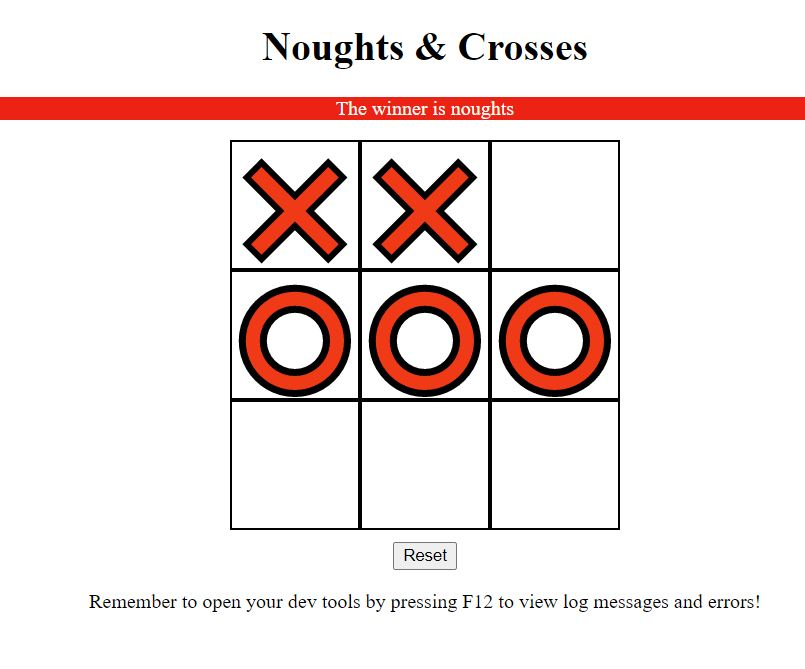

## Noughts & Crosses GAME

A game for two players, X and O, who take turns marking the spaces in a 3×3 grid. The player who succeeds in placing three of their marks in a diagonal, horizontal, or vertical row is the winner.
[More about gameplay on the Wikipedia site]("https://en.wikipedia.org/wiki/Tic-tac-toe")

## Tech/framework used

The game is written using JavaScript language. HTML and CSS. Works with any browser.

## Getting started

It needs to be forked and cloned to the local computer. It works in a browser without any additional package installation.

## Features

The static game requires two players.
In the console there will be a few hints when the game's main functions are called.

## How to use?

Each player should click on the empty field on their turn. The game will show the final result on the screen. After reaching the winning state the player should click the reset button.
